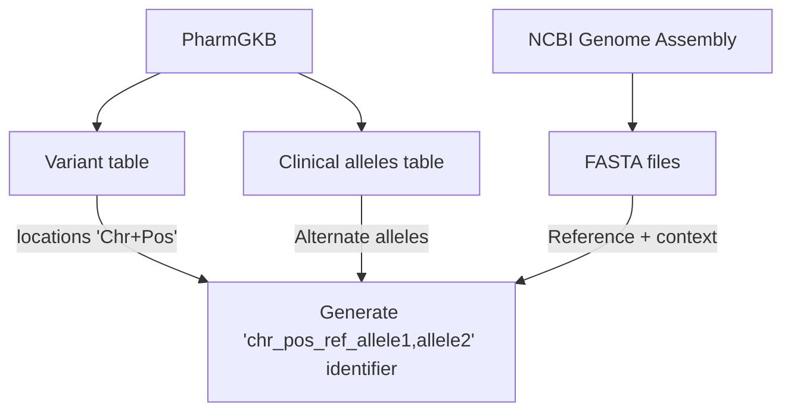

# opentargets-pharmgkb
Pipeline to provide evidence strings for Open Targets from PharmGKB

## How to run
```
# Download data
export DATA_DIR=<directory for data>
wget https://api.pharmgkb.org/v1/download/file/data/clinicalAnnotations.zip
wget https://api.pharmgkb.org/v1/download/file/data/drugs.zip
wget https://api.pharmgkb.org/v1/download/file/data/variants.zip
wget https://api.pharmgkb.org/v1/download/file/data/relationships.zip

unzip -j clinicalAnnotations.zip "*.tsv" -d $DATA_DIR
unzip -j clinicalAnnotations.zip "CREATED*.txt" -d $DATA_DIR
unzip -j drugs.zip "*.tsv" -d $DATA_DIR
unzip -j variants.zip "*.tsv" -d $DATA_DIR
unzip -j relationships.zip "*.tsv" -d $DATA_DIR
rm clinicalAnnotations.zip drugs.zip variants.zip relationships.zip

# Run pipeline
generate_evidence.py --data-dir $DATA_DIR --fasta <path to fasta> --created-date <created date> --output-path evidence.json
```

## Schema documentation

Unless otherwise mentioned, data is taken directly from PharmGKB.
<!-- TODO update this -->

Field | Description | Example
--|--|--
datasourceId | Identifier for data source | `"pharmgkb"`
datasourceVersion | Date when data dump was generated, formatted YYYY-MM-DD | `"2023-08-05"`
datatypeId | Type of data corresponding to this evidence string (currently only clinical annotation) | `"clinical_annotation"`
studyId | Clinical Annotation ID | `"1449309937"`
evidenceLevel |  Level of evidence (see [here](https://www.pharmgkb.org/page/clinAnnLevels)) | `"1A"`
literature | List of PMIDs associated with this clinical annotation | `["11389482", "27857962"]`
genotypeId | VCF-style (`chr_pos_ref_allele1,allele2`) identifier of genotype; computed as described [below](#variant-coordinate-computation) | `"19_38499645_GGAG_G,GGAG"`
variantRsId | RS ID of variant | `"rs121918596"`
variantFunctionalConsequenceId | Sequence Ontology term, from VEP | `"SO_0001822"`
targetFromSourceId | Ensembl stable gene ID, from VEP | `"ENSG00000196218"`
genotype | Genotype string | SNP `"TA"`, indel `"del/GAG"`, repeat `"(CA)16/(CA)17"`
genotypeAnnotationText | Full annotation string for genotype | `"Patients with the rs121918596 del/GAG genotype may develop malignant hyperthermia when treated with volatile anesthetics [...]"`
drugFromSource | Drug name | `"succinylcholine"`
drugId | CHEBI ID of drug, mapped through OLS | `"CHEBI_45652"`
pgxCategory | Pharmacogenomics phenotype category | `"toxicity"`
phenotypeText | Phenotype name | `"Malignant Hyperthermia"`
phenotypeFromSourceId | EFO ID of phenotype, mapped through ZOOMA / OXO | `"Orphanet_423"`

### Example
Below is an example of a complete clinical annotation evidence string:
```
{
  "datasourceId": "pharmgkb",
  "datasourceVersion": "2023-08-05",
  "datatypeId": "clinical_annotation",
  "studyId": "1449309937",
  "evidenceLevel": "1A",
  "literature": [
    "11389482",
    "27857962"
  ],
  "genotypeId": "19_38499645_GGAG_G,GGAG",
  "variantRsId": "rs121918596",
  "variantFunctionalConsequenceId": "SO_0001822",
  "targetFromSourceId": "ENSG00000196218",
  "genotype": "del/GAG",
  "genotypeAnnotationText": "Patients with the rs121918596 del/GAG genotype may develop malignant hyperthermia when treated with volatile anesthetics (desflurane, enflurane, halothane, isoflurane, methoxyflurane, sevoflurane) and/or succinylcholine as compared to patients with the GAG/GAG genotype. Other genetic or clinical factors may also influence the risk for malignant hyperthermia.",
  "drugFromSource": "succinylcholine",
  "drugId": "CHEBI_45652",
  "pgxCategory": "toxicity",
  "phenotypeText": "Malignant Hyperthermia",
  "phenotypeFromSourceId": "Orphanet_423"
}
```
Other examples can be found in the [tests](tests/resources/expected_output.json), though keep in mind these may not represent real data.

### Variant coordinate algorithm


