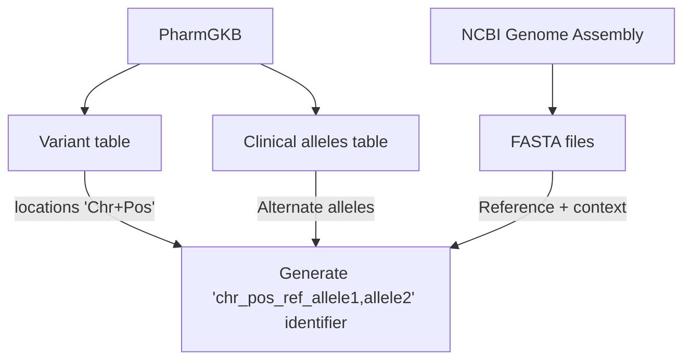

# opentargets-pharmgkb
Pipeline to provide evidence strings for Open Targets from PharmGKB

## Installation

The pipeline only requires Python 3.8+.
Clone the repository (or download a tagged [release](https://github.com/EBIvariation/opentargets-pharmgkb/releases))
and run `python setup.py install`.

(For EVA users, you have to manually run the deployment script for now, pending automated deployment.)

## How to run

### 1. Set up the environment
For EVA, you should log on to Codon SLURM cluster and `become` the EVA production user,
then refer to the [private repository](https://github.com/EBIvariation/configuration/blob/master/open-targets-configuration.md#pharmgkb) for values.
```bash
# The directory where subdirectories for each batch will be created
export BATCH_ROOT_BASE=

# Code location where repository is cloned
export CODE_ROOT=

# Path to GRCh38 RefSeq FASTA file
export FASTA_PATH=
```

### 2. Download data
```bash
# Year and month for the upcoming Open Targets release.
# For example, if you're processing data for “20.02” release, this variable will be set to `2020-02`.
export OT_RELEASE=YYYY-MM

# Create directory structure for holding all files for the current batch.
export BATCH_ROOT=${BATCH_ROOT_BASE}/batch-${OT_RELEASE}
export DATA_DIR=${BATCH_ROOT}/data
mkdir -p ${BATCH_ROOT} ${DATA_DIR}
cd ${BATCH_ROOT}

# Download data
wget https://api.pharmgkb.org/v1/download/file/data/clinicalAnnotations.zip
wget https://api.pharmgkb.org/v1/download/file/data/variants.zip
wget https://api.pharmgkb.org/v1/download/file/data/relationships.zip

unzip -j clinicalAnnotations.zip "*.tsv" -d $DATA_DIR
unzip -j clinicalAnnotations.zip "CREATED*.txt" -d $DATA_DIR
unzip -j variants.zip "*.tsv" -d $DATA_DIR
unzip -j relationships.zip "*.tsv" -d $DATA_DIR
rm clinicalAnnotations.zip variants.zip relationships.zip

# Set the created date
export CREATED_DATE=`ls $DATA_DIR/CREATED*.txt | sed 's/.*\([0-9]\{4\}-[0-9]\{2\}-[0-9]\{2\}\).*/\1/'`
```

### 3. Run the pipeline
```bash
generate_evidence.py --data-dir $DATA_DIR --fasta $FASTA_PATH --created-date $CREATED_DATE --output-path evidence.json

# One-liner for EVA on SLURM
sbatch -t 02:00:00 --mem=8G -J pharmgkb-evidence -o pharmgkb-evidence.out -e pharmgkb-evidence.err \
  --wrap="${CODE_ROOT}/env/bin/python ${CODE_ROOT}/bin/generate_evidence.py --data-dir $DATA_DIR --fasta $FASTA_PATH --created-date $CREATED_DATE --output-path evidence.json"
```

### 4. Manual follow-up actions

Update the [metrics spreadsheet](https://docs.google.com/spreadsheets/d/1Vhdajf_Aps0z9_bbHshbQthl7lHsQLxEnNBKKHUr-GE/edit#gid=0) based on the output of the pipeline.

The evidence string file (`evidence.json`) must be uploaded to the [Open Targets Google Cloud Storage](https://console.cloud.google.com/storage/browser/otar012-eva/) to the **`pharmacogenomics`** folder and be named in the format `cttv012-[yyyy]-[mm]-[dd].json.gz` (e.g. `cttv012-2020-10-21.json.gz`).

Once the upload is complete, send an email to Open Targets (data [at] opentargets.org) containing the following information:
* The number of submitted evidence strings
* The PharmGKB release date
* The Ensembl release
* The EFO version used for mapping
* The `opentargets-pharmgkb` pipeline version
* The Open Targets JSON schema version

## Schema documentation

Unless otherwise mentioned, data is taken directly from PharmGKB.

Field | Description | Example
--|--|--
datasourceId | Identifier for data source | `"pharmgkb"`
datasourceVersion | Date when data dump was generated, formatted YYYY-MM-DD | `"2023-08-05"`
datatypeId | Type of data corresponding to this evidence string (currently only clinical annotation) | `"clinical_annotation"`
studyId | Clinical Annotation ID | `"1449309937"`
evidenceLevel |  Level of evidence (see [here](https://www.pharmgkb.org/page/clinAnnLevels)) | `"1A"`
literature | List of PMIDs associated with this clinical annotation | `["11389482", "27857962"]`
genotypeId | VCF-style (`chr_pos_ref_allele1,allele2`) identifier of genotype; computed as described [below](#variant-coordinate-computation) | `"19_38499645_GGAG_G,GGAG"`
variantRsId | RS ID of variant | `"rs121918596"`
variantFunctionalConsequenceId | Sequence Ontology term, from VEP | `"SO_0001822"`
targetFromSourceId | Ensembl stable gene ID, from VEP (rsIDs) or PGKB mapped through BioMart (named alleles) | `"ENSG00000196218"`
genotype | Genotype or allele string | SNP `"TA"`, indel `"del/GAG"`, repeat `"(CA)16/(CA)17"`, named allele `"*6"`
genotypeAnnotationText | Full annotation string for genotype or allele | `"Patients with the rs121918596 del/GAG genotype may develop malignant hyperthermia when treated with volatile anesthetics [...]"`
directionality | Allele function annotation (see Table 2 [here](https://www.ncbi.nlm.nih.gov/pmc/articles/PMC5253119/)) | `"Decreased function"`
haplotypeId | Name of haplotype; can be an allele or a genotype | `"CYP2B6*6"` or `"GSTT1 non-null/non-null"`
haplotypeFromSourceId | Internal PGKB identifier for the haplotype | `"PA165818762"`
drugs | List of drugs (see [below](#drug-representation)) | `[{"drugFromSource": "ivacaftor"}, {"drugFromSource": "lumacaftor"}]`
pgxCategory | Pharmacogenomics phenotype category | `"toxicity"`
phenotypeText | Phenotype name | `"Malignant Hyperthermia"`
phenotypeFromSourceId | EFO ID of phenotype, mapped through ZOOMA / OXO | `"Orphanet_423"`

### Example
Below is an example of a complete clinical annotation evidence string:
```
{
  "datasourceId": "pharmgkb",
  "datasourceVersion": "2023-08-05",
  "datatypeId": "clinical_annotation",
  "studyId": "1449309937",
  "evidenceLevel": "1A",
  "literature": [
    "11389482",
    "27857962"
  ],
  "genotypeId": "19_38499645_GGAG_G,GGAG",
  "variantRsId": "rs121918596",
  "variantFunctionalConsequenceId": "SO_0001822",
  "targetFromSourceId": "ENSG00000196218",
  "genotype": "del/GAG",
  "genotypeAnnotationText": "Patients with the rs121918596 del/GAG genotype may develop malignant hyperthermia when treated with volatile anesthetics (desflurane, enflurane, halothane, isoflurane, methoxyflurane, sevoflurane) and/or succinylcholine as compared to patients with the GAG/GAG genotype. Other genetic or clinical factors may also influence the risk for malignant hyperthermia.",
  "drugs": [
    {"drugFromSource": "succinylcholine"}
  ],
  "pgxCategory": "toxicity",
  "phenotypeText": "Malignant Hyperthermia",
  "phenotypeFromSourceId": "Orphanet_423"
}
```
Other examples can be found in the [tests](tests/resources/expected_output.json), though keep in mind these may not represent real data.

### Variant coordinate algorithm



### Drug representation

The `drugs` property is a list of structs with 2 keys:
* `drugFromSource`: name of the drug from PGKB
* `drugId`: CHEMBL ID, left empty in this pipeline but populated by Open Targets 

Lists of drugs are kept together (rather than exploded into separate evidence strings) when they're known to be annotated as a drug combination.
Currently this is only when they're `/`-separated and associated with a single PGKB chemical ID, as in [ivacaftor / lumacaftor](https://www.pharmgkb.org/chemical/PA166152935).
